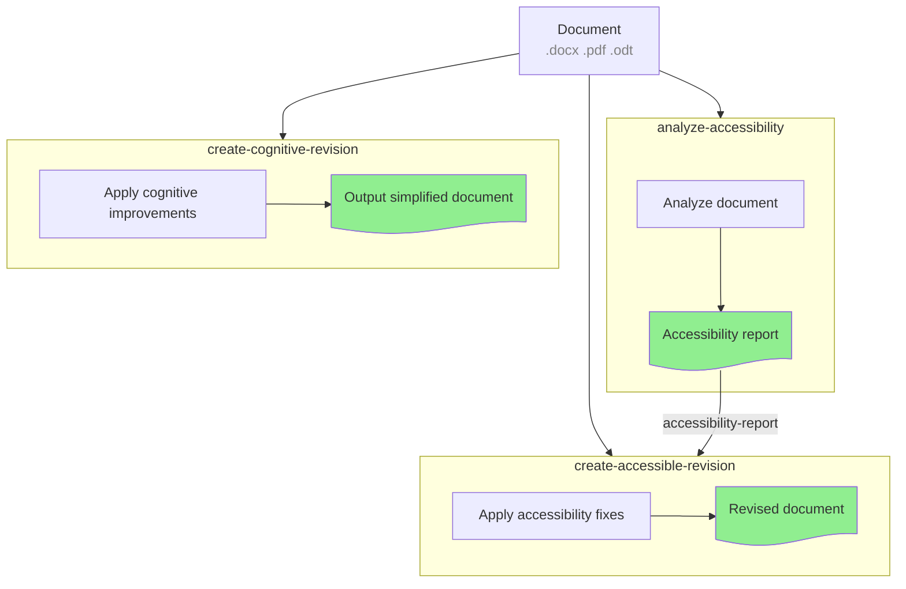

# Accessibility Skills

A collection of AI agent skills for accessibility reviews of office documents.

## Available Skills

### 1. Analyze Accessibility (`skills/analyze-accessibility`)
Analyzes documents and generates accessibility reports.

**What it does:**
- Performs OCR when needed to detect text in images
- Checks WCAG 2.1 compliance
- Generates detailed JSON and human-readable reports
- Highlights issues with severity levels (critical, major, minor, suggestion)

| **Type** | **Document** |
| --- | --- |
| **Input** | Document (.docx, .doc, .pdf, .odt) |
| **Output** | `accessibility-report.json` + human-readable summary |

### 2. Create Accessible Revision (`skills/create-accessible-revision`)
Generates improved, accessible versions of documents.

**What it does:**
- **Mode A (automatic):** Analyzes document → generates report → applies fixes
- **Mode B (report-based):** Uses existing accessibility report to apply fixes
- Preserves original content and intent
- Produces a WCAG-compliant version

| **Type** | **Document** |
| --- | --- |
| **Input** | Document (+ optional accessibility report) |
| **Output** | Revised document + revision summary |

### 3. Create Cognitive Revision (`skills/create-cognitive-revision`)
Analyzes and simplifies document content for cognitive accessibility.

**What it does:**
- **Mode A (automatic):** Analyzes complexity → determines target level → simplifies
- **Mode B (targeted):** Simplifies for specific audience (dyslexia, ADHD, low literacy, etc.)
- Reviews language complexity (readability scores)
- Generates a cognitively accessible version

| **Type** | **Document** |
| --- | --- |
| **Input** | Document (+ optional target audience) |
| **Output** | Simplified document + cognitive report + glossary |

## Quick Start

To use any skill, load the `instructions.md` file content. Schemas define expected inputs/outputs.

## Architecture

```
accessibility-checker-skill/
├── README.md
├── schemas/                          # Shared JSON schemas
│   ├── accessibility-report.json
│   ├── cognitive-analysis.json
│   ├── cognitive-report.json
│   └── revision-request.json
└── skills/
    ├── analyze-accessibility/
    │   ├── instructions.md
    │   └── schemas/
    │       └── accessibility-report.json
    ├── create-accessible-revision/
    │   ├── instructions.md
    │   └── schemas/
    │       └── revision-request.json
    └── create-cognitive-revision/
        ├── instructions.md
        └── schemas/
            ├── cognitive-analysis.json
            └── cognitive-report.json
```

## Schema Definitions

Schemas are based on WCAG 2.1 guidelines and include:

- **WCAG Principles:** Perceivable, Operable, Understandable, Robust
- **Severity Levels:** critical, major, minor, suggestion
- **Issue Categories:** images, structure, links, tables, forms, color, navigation, language

## Skill Relationships



## Contributing

When adding new skills:
1. Create a folder under `skills/`
2. Add `instructions.md` with role, tools, and workflow
3. Add JSON schemas for all inputs/outputs
4. Update this README